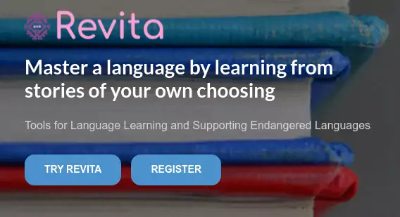

- Registering and login
    - [Why should I register in Revita?](#why-should-i-register-in-revita)
    - [How can I change my user name, email or password?](#how-can-i-change-my-user-name-email-or-password)
- My Library
    - [Do other people see my stories?](#do-other-people-see-my-stories)
    - [Can I share a story with a friend?](#can-i-share-a-story-with-a-friend)
- Practice
    - [How does Revita create exercises based on your chosen story?](#how-does-revita-create-exercises-based-on-your-chosen-story)
    - [How are flashcards collected?](#how-are-flashcards-collected)
    - [Why do flashcards have different colors?](#why-do-flashcards-have-different-colors)
    - [What is a story's rating?](#what-is-a-storys-rating)
    - [What does my rating mean?](#what-does-my-rating-mean)
- Groups
    - [What is a Group?](#what-is-a-group)
    - [How can I join a group?](#how-can-i-join-a-group)
- Other
    - [My question is not in this list, whom can I ask?](#my-question-is-not-in-this-list-whom-can-i-ask)

<!-- table of contents created by Adrian Bonnet, see https://Relex12.github.io/Markdown-Table-of-Contents for more -->

____________________________________________________________________________
____________________________________________________________________________
### Why should I register in Revita?

You can use Revita in "*guest*"  mode, without registering.  However, if you register, Revita can offer you important features, such as:

* adding stories to your own private library (if you are not registered, Revita can't link the library to you),
* keeping track of your progress over time — analyzing your level of proficiency is essential  to make sure that the exercises optimally fit your level: are not too easy and not too difficult too often.

Note, when you register, you create a user name, by which other users can see you in the system.  Your email address is used for registration **only**, and **is not** published or revealed in any way — it is completely safe.

____________________________________________________________________________
### How can I change my user name, email or password?

Your personal information can be viewed and edited in the <u>Profile</u> ⇒ <u>Account  View</u>.  You can reach it by clicking on the <u>Profile</u> icon or the <u>Settings</u> icon.

The Account view allows you to change your user name or your password.  Currently, the email of the account cannot be changed.  In the near future we will enable also the changing of the email.

If you've *forgotten your password*, you can always request a form to renew the password via your email address.

____________________________________________________________________________
____________________________________________________________________________
### Do other people see my stories?

All stories you upload to your **private library** are visible only to you.  There is no way anyone else can look inside your private library.

You can now [share stories](#can-i-share-a-story-with-a-friend) with your friends — you can choose a particular story and send it to a friend; if the friend accepts it, it will appear in her own private library.

____________________________________________________________________________
### Can I share a story with a friend?

You share any story you like with your friends:

* Select a story from your private library, and click **Share story**.
* Enter the friend's **email** address in Revita.
* You can include an optional **message** about the story.
* The friend will receive a **notification** - if she accepts the story, it will appear in her private library.
* The friend can also **follow** you: if she follows you, stories that you send her will be added to her private library automatically, without notification.
* The list of **followed** friends appears in the Profile page.

____________________________________________________________________________
____________________________________________________________________________
### How does Revita create exercises based on your chosen story?

- Revita analyzes each story,
- Divides it into snippets (2-3 sentences each),
- For each snippet, creates exercises that match the level of the learner:
    + Words and phrases in the story are linked to grammatical topics that the learner needs to master.
    + The map of the topics can be seen by going to the Home Page ⇒ Progress ⇒ Grammar Progress
    + Revita selects which grammatical topics are best suited to the learner's current level.
    + Learner's level is evaluated based on all preceding answers to exercises: which topics the learner finds easy / difficult.
- Revita tries to select exercises that match the learner's level:
    + if exercises are often too easy — the learner will become bored,
    + if exercises are often too difficult — the learner will become frustrated,
- In either case — she will quit practicing. Thus it is very important to find the right level of difficulty, though sometimes there may be an easy or a difficult exercise.
- Exercises are selected at random, so each time you work with a story, the exercises will be different.

<!---
    - [Как Ревита создает упражнения на основе текста ?](#как-ревита-создает-упражнения-на-основе-текста-)

____________________________________________________________________________
### Как Ревита создает упражнения на основе текста ?

Ревита анализирует каждый тескт, разбивает его на кусочки (примерно 2-3 предложения), и для каждого кусочка создает упражнения, настроенные на уровень ученика:

1. Все фразы и слова в тексте связаны с лингвистическими конструктами, которые ученик должен усвоить.  Схему конструктов можно увидеть в настройках, нажав "Настройки" ⇒ "Настройки обучения".  Конструкты могут быть включены / отключены в ручном режиме, или (более рекоммендуемо) оставить все конструкты включенными, и предоставить Ревите возможность выбирать подходящие конструкты в соответствии с уровнем знаний ученика.   
Уровень ученика оценивается на основе всех предыдущих ответов на упражнения — какие конструкты для ученика проще, какие сложнее.
1. Ревита старается подбирать упражнения, в среднем  подходящие для ученика по уровню:

   * если упражнения слишком просты слишком часто, ученику наскучит, и он бросит занятия,
   * если упражнения слишком сложны слишком часто, ученик будет перегружен, и бросит занятия.
Поэтому очень важно, чтобы уровень упражнений оптимально соответствовал уровню ученика в среднем — т.е. ученик может получать очень сложные или очень простые упражнения, но это случается редко.
1. Упражнения выбираются из текста случайным образом, так что при каждом прохождении текста, уражнения будут новыми — это позволяет многократно упражняться с одним и тем же текстом, и делает упражнения более разнообразными и менее скучными.
--->

____________________________________________________________________________
### What is a story's rating?

For each story, Revita tries to estimate its level of difficulty.  The difficulty depends on many factors: on the levels of difficulty of the concepts found in the story, on how difficult/rare the words in the story are, etc.  The story''s rating is used in computing the learner's rating, explained in part here.  

In the library, the difficulty is marked by one to three stars. 

____________________________________________________________________________
### How are flashcards collected?

Revita creates **Flashcards** for you when you are reading or practicing with a story: any time when you see an unfamiliar word, you can click on it — that will display the word's translation (in a language of your choice), and will also add that word to your deck of flashcards.  The flashcard will contain 3 things:

* the word
* its translations
* a "hint" — the context (sentence) in which you saw and clicked the word.
  
You can review your vocabulary in the "Flashcard" exercises.  If you don't remember the word, you can ask to look at hints.  You can practice with your vocabulary

* either with all of your flashcards (by clicking <u>Flashcards</u> on the Menu Bar),
* or with each story separately (by clicking <u>Flashcards</u> under the story).
  
You can add new flashcards, edit any flashcard in your deck, and delete any flashcards you don't like / need.

____________________________________________________________________________
### Why do flashcards have different colors?

Flashcards track how difficult you find words in the vocabulary.  Easier words — whose meaning you know most of the time — have greener color, and more difficult words — which are harder to remember — have redder color, and words in between are yellowish.

The color tells "how well" you have mastered this word so far.  Cards are shown in random order which is based on the [spaced repetition](https://en.wikipedia.org/wiki/Spaced_repetition) algorithm to use the psychological spacing effect.

Blue cards are special —

* They are words that you saw in some story that you read, but you did **not** click — i.e., you probably  know these words.  They are chosen to be among the "hardest" words in the story.
* To estimate your vocabulary skill as accurately as possible, Revita occasionally shows you some blue cards.
* A blue card will appear only once if you know the meaning of the word.
* If it turns out that in fact you do not know it, your vocabulary esimates take this into account.  Also, the card will enter into your deck (as a red card).

____________________________________________________________________________
____________________________________________________________________________
### What is a Group?

You can join a group if you are learning with a teacher.  Groups are created by teachers — at a school, a university, private tutors, etc.  A teacher can add her students (and additional teachers) to a group.  The purpose of a group is:
* Each Group has a Library, where the teacher uploads stories that she recommends as helpful for the students.
* The teacher can follow how well the students are practicing with the stories.  The teacher can see — for the entire group — which topics the students have mastered, and which are more challenging, so the teacher can plan the lectures better.

(Optional:)
* The teacher can control the _learning settings_ for all stories in a Group Library — which exercises are enabled.  
* The teacher also enable <u>Tests</u> — for a fixed period of time.  Tests are available for some languages.

____________________________________________________________________________
### How can I join a group?

Groups are organized by the teacher.  The teacher invites the students to join the group by:

* Adding students to the Group — using their email addresses — and sending them invitations.  The student must accept the invitation to join the group.
* Sharing a secret *key* with the students.  The key allows the student to join the group immediately, no invitation needed.  The key is valid for 30 days; if the student has not joined in 30 days, a new key must be created.  To join a group using a key, go to _Side Bar ⇒ More ⇒ Groups_.

____________________________________________________________________________
### What does my rating mean?

The rating is based on the Élő formlula — it is the method used to rate players in chess and in many on-line games — except here the "players" are the learner and the **exercises**.  Each exercise has a difficulty level, which is its own "rating". 

The Élő rating in Revita means approximately as in chess:

* a beginner (who just knows the rules of the game) has a rating of 1000 or below.
* a fairly strong player is above 1800.
* a master is between 2200 and 2400.
* a grandmaster is above 2400 (the world champion is usually around 2800).
  
The Élő formula updates the rating after every exercise (every "match") as follows:

* if the learner has a low rating and the exercise is very difficult — if the learner answers the exercise correctly, her rating gains many points. 
* if the learner has a high rating and the exercise is very easy — if the learner answers the exercise correctly, her rating gains very few (or no) points.
* if the learner has a high rating and the exercise is very easy — if the learner answers the exercise incorrectly, her rating loses many points.
* etc.

| **learner rating** | **exercise difficulty** | **answer correct?** | **effect on score**    |
|--------------------|-------------------------|---------------------|------------------------|
| **low**            | low                     | +                   | small increase         |
| **low**            | low                     | -                   | small drop             |
| **low**            | high                    | +                   | large increase         |
| **low**            | high                    | -                   | small (or no) drop     |
| **high**           | low                     | +                   | small (or no) increase |
| **high**           | low                     | -                   | large drop             |
| **high**           | high                    | +                   | small increase         |
| **high**           | high                    | -                   | small drop             |
| **...**            | ...                     | ...                 | ...                    |

The idea is that the increase or loss reflects the **expectation** or surprise — a low-rated player is expected to answer a difficult question wrong, but it is a big surprise if she answers a difficult question correctly!  So your rating changes depending two things: your current rating **and** the difficulty of each exercise.  For more details, please read about the Élő formula (e.g., in [Wikipedia](https://en.wikipedia.org/wiki/Elo_rating_system)).

Based on your rating, Revita also tries to estimate your CEFR level — a rating around 1000 is near A1, rating over 2200 is C2, and the rest are in between.  These estimates are approximate, and will be improved over time.

____________________________________________________________________________
____________________________________________________________________________
### My question is not in this list, whom can I ask?

If you have any questions — or suggestions or comments — please contact the team through the <u>Contact</u> page, or write to the Revita team at  revita@cs.helsinki.fi
