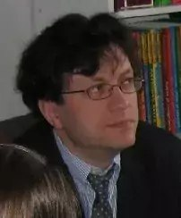

### University of Helsinki

|    | [__Jue Hou__](https://researchportal.helsinki.fi/fi/persons/jue-hou) — doctoral researcher. |
|     | [__Silja Huttunen__](https://researchportal.helsinki.fi/fi/persons/silja-huttunen) |
|    | [__Anisia Katinskaia__](https://researchportal.helsinki.fi/fi/persons/anisia-katinskaia) — doctoral researcher. |
|    | [__Anh-Duc Vu__](https://researchportal.helsinki.fi/fi/persons/duc-vu-anh) — doctoral researcher. | 
|    | [__Roman Yangarber__](https://researchportal.helsinki.fi/fi/persons/roman-yangarber) — professor. |

### Collaborators

- [Lari Kotilainen](https://researchportal.helsinki.fi/fi/persons/lari-kotilainen) — Professor, Department of Finnish.  [Kielibuusti Project](https://kielibuusti.fi/en)

- [Mikhail Kopotev](https://researchportal.helsinki.fi/fi/persons/mikhail-kopotev) —
  Senior Lecturer, Department of Modern Languages.  Russian
