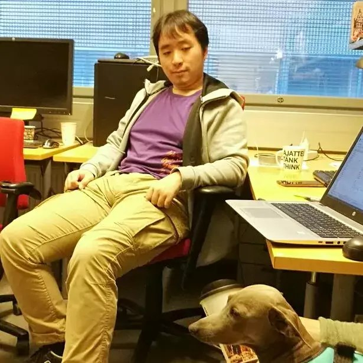
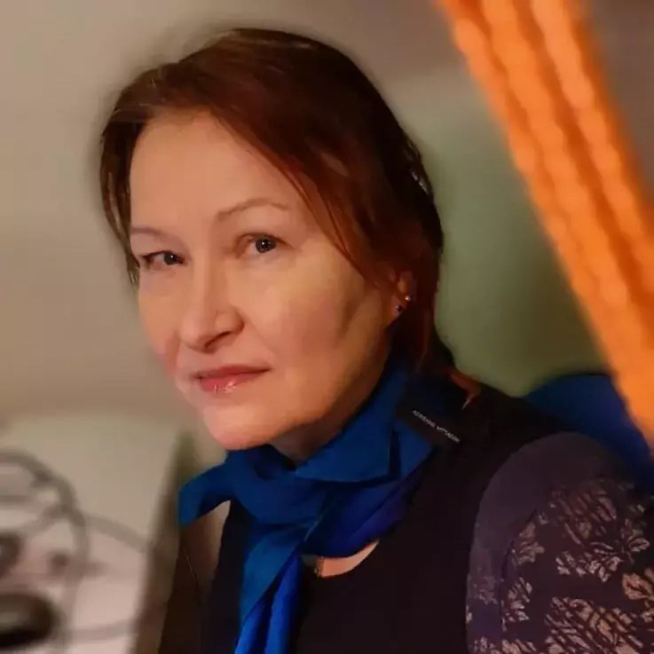
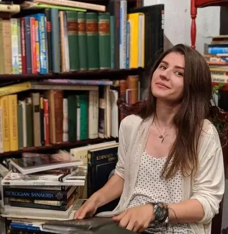
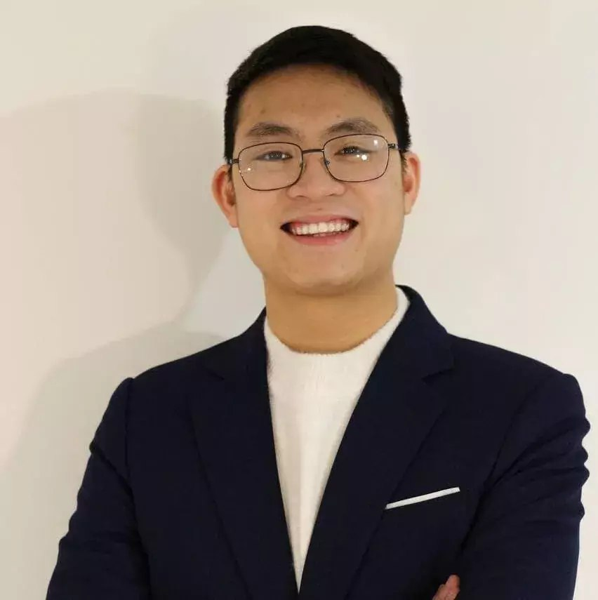
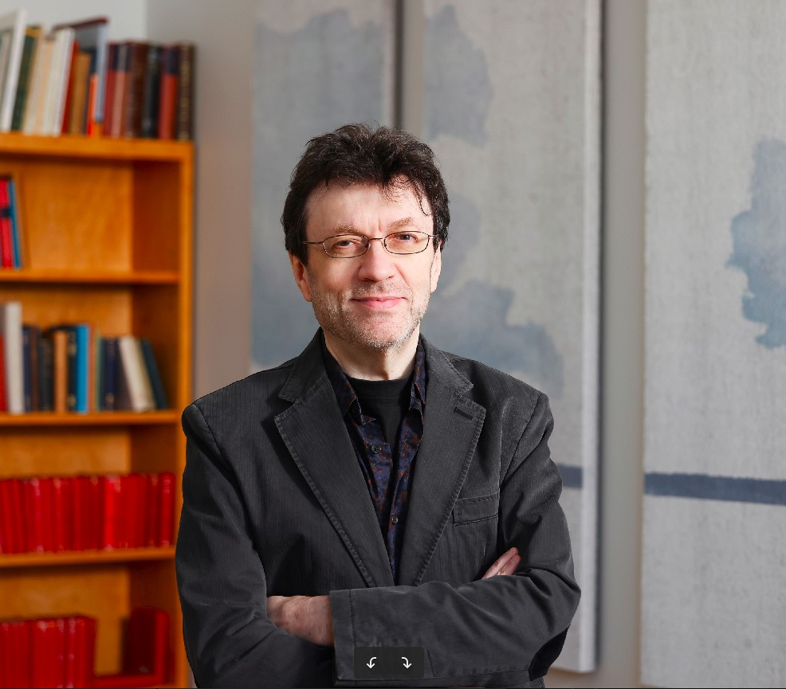

### University of Helsinki

|    | [__Jue Hou__](https://researchportal.helsinki.fi/fi/persons/jue-hou) — PhD student.    Research focus on modeling learner proficiency, language modeling with deep-learning neural nets, scalability, educational data science — to analyze data collected from studies with learners.  |
|    | [__Silja Huttunen__](https://researchportal.helsinki.fi/fi/persons/silja-huttunen) — PhD (University of Helsinki).    Conducting user studies, and experiments with teachers and learners. Finnish, Italian. |
|    | [__Anisia Katinskaia__](https://researchportal.helsinki.fi/fi/persons/anisia-katinskaia) — PhD Student.    All aspects of user studies, especially Finnish, Russian, English, Italian.  Research on language modeling for detection and correction of grammatical errors; identifying "alternative-correct" settings — where there is more than one correct answer. |
|    | [__Anh-Duc Vu__](https://researchportal.helsinki.fi/fi/persons/duc-vu-anh) — PhD Student.    Bayesian networks and deep learning models of learner proficiency and progress — essential for personalization in Revita — accurate modeling of learner competency to provide suitable exercises and feedback. | 
|    | [__Roman Yangarber__](https://researchportal.helsinki.fi/fi/persons/roman-yangarber) — professor, Chair in Linguistic Inequalities and Translation Technologies at _INEQ: The Helsinki Inequality Initiative_.   Leads the Language Learning Lab — studying how language works, and how computers can better understand language.  Research on analysis of news media, modeling language evolution, AI support for language learning.  Revita, currently in use by learners and teachers at several universities.  Research on support for smaller, endangered languages, as well as for "majority" languages. |

## Collaborators

- [Lari Kotilainen](https://researchportal.helsinki.fi/fi/persons/lari-kotilainen) — Professor, Department of Finnish.  [Kielibuusti Project](https://kielibuusti.fi/en), principal advisor on applied linguistics (Finnish).
- [Mikhail Kopotev](https://researchportal.helsinki.fi/fi/persons/mikhail-kopotev) —
  Senior Lecturer, Department of Modern Languages, principal advisor on applied linguistics (Russian).
- [Matti Luukkainen](https://www.helsinki.fi/en/people/people-finder/matti-luukkainen-9021313) — University lecturer (UH), leads the TOSKA Reseach Group.  Principal advisor on best practices for Software Engineering, Web development and User Experience.  Supervising Gert Adamson, Atte Haarni, Esa Kemppainen, Jami Kousa, Ilmari Kylliäinen, Tero Tapio, and other TOSKA members, who have made substantial contributions.
- Jouko Ahvenainen — (London, UK).  Advisor on user-centric approaches in artificial intelligence.
- [Maria Lebedeva](https://www.pushkin.institute/sveden/employees/detail.php?ELEMENT_ID=4096) — (Pushkin Institute, Moscow). Longitudinal studies (Russian).
- Vesna Hendry, Tommaso Furlan — (Udine, Italy).  Design of user interface, user experience.
- [Mikhail Mikhailov](https://www.tuni.fi/en/mikhail-mikhailov) — professor (Translation Studies, Tampere University, Finland).  Studies with university learners (Finnish and Russian).
- [Nataliya Stoyanova](https://docenti.unicatt.it/ppd2/it/docenti/27572/nataliya-stoyanova/profilo) — associate professor (Catholic University, Milan, Italy).  Principal advisor on applied linguistics: studies with university learners (Russian).
- [Laila Paracchini](https://www.unimi.it/en/ugov/person/laila-paracchini) — PhD, Research Fellow, Department of Foreign Languages and Literatures (State University of Milan, Italy).  Principal advisor on Russian: studies with university learners (Russian).
- Annel Baktybaeva — Head of Linguistics Department (Kazakh National Medical University, Almaty, Kazakhstan). Second-language teaching (Russian, Kazakh).
- Alsu Zakirova — MA student (Higher School of Economics, St Petersburg, Russia).  Support for Tatar: development of linguistic topics, and feedback for learners.
- Mikhail Zolotilin — MA (UH).  Linguistic resources (Russian).
- [Jouni Rostila](https://researchportal.helsinki.fi/en/persons/jouni-rostila) — University lecturer (UH).  Principal advisor on applied linguistics for German.

## Alumni

- Javad Nouri — MS (UH).  Built all components of the original Revita platform.  Initial focus on endangered Finno-Ugric languages, Finnish, Russian.
- Kim Salmi — MS (UH).  Front-end and back-end of the early platform.
- José María (Txema) Hoya Quecedo — MS (UH).  Core support cross-language handling of morphological and syntactic analysis.  Models of ambiguity and disambiguation.  Initial support for Romance languages (β).
- Max Koppatz — MS (UH). Improvements to the language-analysis layer and exercise selection.   Deep-learning language modeling, work on Finnish, Swedish and German (β).
<!-- - Tomi Rikander — MS Student.  Front-end improvements and re-engineering. -->
- Sardana Ivanova — PhD (UH).  Support for Russian, Sakha (Yakut).
- Elena China-Kohlemainen — Master of Arts (UH).  Support for Italian: learning topics and feedback. [MA Thesis (2021) "Computer-Assisted Language Learning based on Authentic Texts: Applications to Italian"](https://helda.helsinki.fi/handle/10138/335693)
- Minerva Ciccarese — BA (UH). Support for Italian: government, constructions.
- Giacomo Furlan — MS (UH, University of Pisa). Support for Italian, deep learning language models for disambiguation.
- Gert Adamson — MS (UH).  Member of TOSKA, REACT-based front-end, user experience.
- Ilmari Kylliäinen — MS (UH).  Work with the TOSKA Group: latest in front-end technologies and software engineering, to create a friendly user experience (UX) for learners and teachers.  MS in Language Technology.
